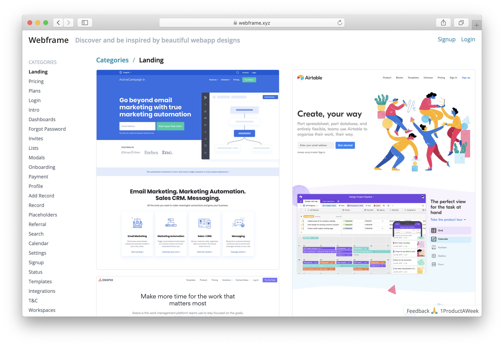
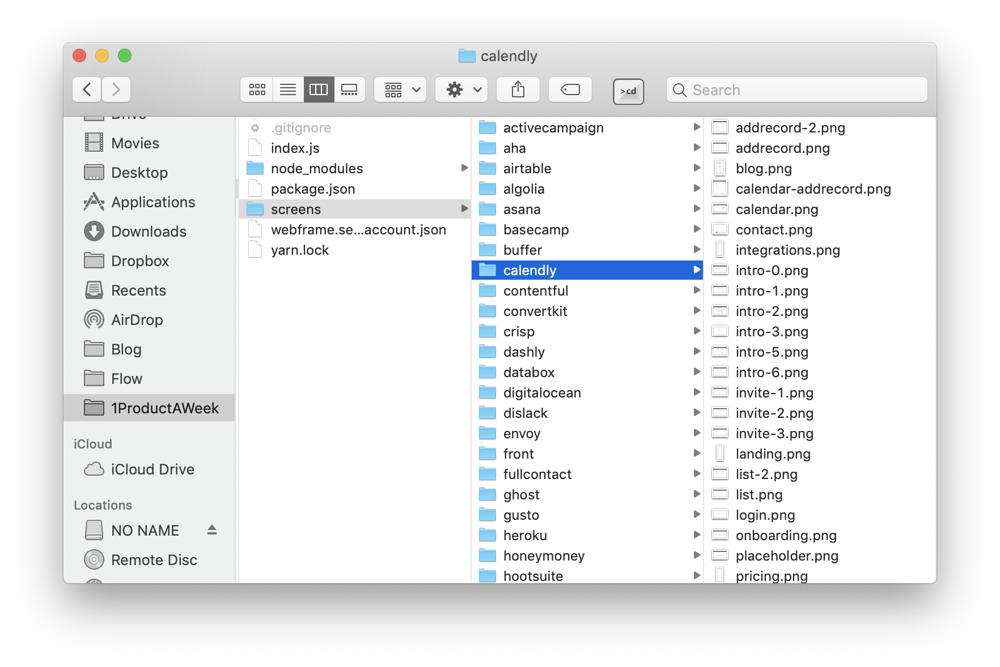
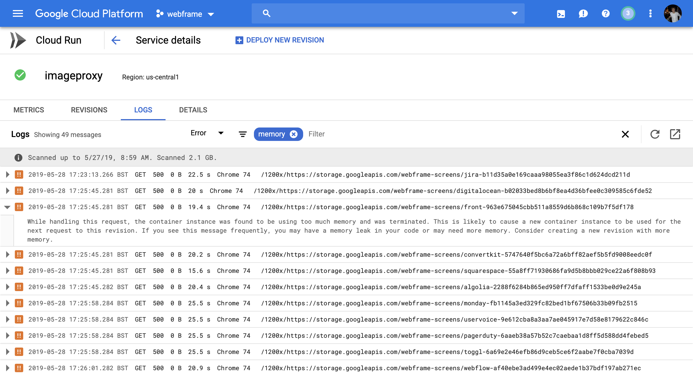
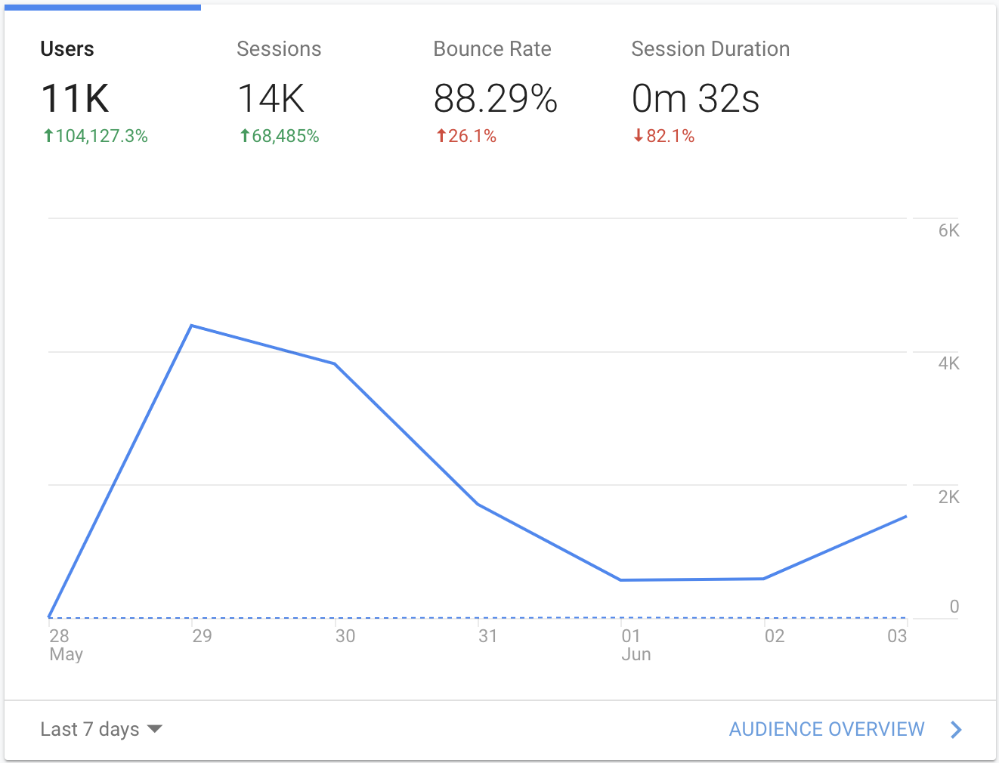

So it’s now been almost a week since the launch of [Webframe](https://webframe.xyz), and I thought now would be a good time to reflect on how it’s all gone down.

First, it was much more successful than I had ever anticipated! I somehow managed to not only get #1 product on Product Hunt for the day, but also the week! That surpassed my wildest dreams - a massive thank you 🙏 to everyone who upvoted it!

### Product Dev

I feel the build and development went well overall, I progressed through the tasks relatively quickly. The major challenges I encountered where:

   * Uploading screens (quickly)
   * Caching and resizing the images
   * Creating the account section

#### Uploading screens

Given I wanted to have >1000 screenshots on the site (I ended up with ~800), it was absolutely critical to find a way to upload screenshots (and their associated metadata - e.g. name, category, product, etc) as quickly as possible. This was made harder by the fact that I wanted to take screenshots from *behind the signup wall*, and so it was going to be very difficult to automatically crawl and screenshot these pages.

So how do you manually take screenshots, tag them with the relevant data and upload them to your site quickly? First, I considered creating an admin page. It would allow me to drop in an image and then fill in the details - but given I had just one week - building an admin page felt like the wrong way to go. 

In the end, I came up with a little hack (if you can call it that) to use the file system and GCP storage as the CMS! First, I would create a folder for each product (e.g. `/screens/stripe`) and then I would add each screenshot with the name of the categories it belongs to in the format `<cat1>-<cat2>-<cat...>.png` (e.g. `/screens/stripe/settings-modal.png`). 

I then ran a simple script that looped through each directory, and uploaded the files to Google Cloud Storage. As part of the upload, it would rename the file to `product-<md5>.png`, and attach product and category metadata (derived from the file name/path) to the file. Using an MD5 hash in the name allowed me to keep the filename consistent, even when changing categories - which meant any references to the file (e.g. in the Firebase persistent store) would still be valid.

I then used the Google Cloud Storage API to get a list of the files and their metadata, and used that to populate the React Static site! ⚡️

#### Caching and resizing

I wanted to have high resolution images on the site, so a user could click an image and have it appear almost in full size (e.g. below). But I also needed to have a smaller version for the list view, otherwise the page would take forever to load. I'd then cache these images to speed up delivery.

My first attempt to do this was using [Fly](https://fly.io) which promised to both resize and cache my images. But with limited examples and a bit of a confusing API, I struggled to get it to work properly. I then moved to using a [ImageProxy](https://github.com/willnorris/imageproxy), a dockerized `go` package that promised to resize images on the fly and then cache the result back to Google Cloud Storage. Yum! 

Using a dynamic resizer seemed like a good option, as it would allow me to remain flexible and choose the image sizes from the client. After a few Dockerfile adjustments (to make it work with Google Cloud Run), I was able to get this up and running. I then put the Google Cloud Run endpoint behind a free Cloudflare cache. 

It worked pretty well, although the ImageProxy service kept running out of memory. I ended up maxing the RAM to 2GB and that made it relatively stable. It wasn't too much of a problem as mostly visitors would hit the Cloudflare cache - basically Cloudflare saved my life 😍!

In hindsight, as I only ended up using two sizes of screenshot, I should have just uploaded them both during the initial upload step (see step above). It would have limited me to only using those pre-defined sizes, but I didn't need any more than that and I could have avoided ImageProxy and Google Cloud Run completely.

#### Creating the account section

I used Firebase for the persistent storage and the authentication, and it worked really well. I got it working with hooks in no time at all, and it was really easy to bind my component to the Firebase state (I wrote an article on [how I used hooks with Firebase](https://medium.com/1productaweek/custom-hooks-firebase-d2e2972ff9d8)).

I will be using Firebase again!

### Launch Day

It’s funny, even after only working on Webframe for a week - I still became fairly attached it. Yet, at the same time, just before the launch I was like - no, this is a terrible idea. Nobody is going to want this. I guess that’s just the shackles of launch fear rearing its ugly head again. 

Thankfully, I was able to push past it - I was absolutely determined, whatever the result, to launch on that day.

So I hit that launch button (actually it was anti-climatically scheduled for me 😂) and waited for those upvotes to roll in. 

But then… after 5 minutes of frantic refreshing I was still stuck in the “newest” section (you know - the one nobody ever checks), my product had five upvotes and I thought - something is wrong - I should cancel this entire launch.

I think if there had been an abort button, at that point, I would have pressed it. Thankfully, ProductHunt doesn’t let you do that. And, after another five anxiety filled minutes it moved to the Popular section and started steadily picking up upvotes 😅.

I spent the rest of the day hammering refresh on my browser, and continually trying to further promote it wherever I could. I e-mailed my mailing list, reached out to the communities I’m part of (mostly on Slack), and publicised it as much as I could on social networks (e.g. Reddit / Twitter). I also offered people the chance to be included on the site, which meant adding them in real-time on the launch day.

The e-mails and community posts seemed to be fairly effective - I got a few replies letting me know they had upvoted (and possibly more, that didn’t reply). 

I’m not sure the social network activity did that much, probably because I don’t have an existing following! But it felt good to be doing something, anything that might contribute to the success of the product. I guess if I’d had a bigger social following it may have made more of a difference.

It was a close battle with the other products that day, and I was behind until around 12.00pm BST. It got especially nerve wracking when Neil Patel launched his free SEO tool (at around lunch time) and climbed up the rankings very quickly! But in the end I managed to stay in front for the rest of the day (even if the the margin was only 30 upvotes for the most part). It was a pretty tense day!

If you’d like to read-up more on my takeaways for launching on Product Hunt check out this article - Get #1 on Product Hunt, without an existing following

### The Results

Ok, so what did I achieve from launching on Product Hunt? Here are the stats!

* 11K unique visitors to webframe.xyz
* 952 unique visitors to 1productaweek.com (roughly 10%!)
* 516 accounts created on webframe.xyz
* 107 new subscribers to 1productaweek.com e-mail list
* 102 new Twitter followers for @1productaweek
* [1 podcast request](https://www.youtube.com/watch?v=MxKZmCspqGM)

The bounce rate is very high - I suspect because people check it out, bookmark it (hopefully) and then come back to it when they need it. There was nothing compelling them to stay longer if they weren’t in design inspiration mode right now. Hopefully those sessions will increase over time.

Apart from that, I’m pretty happy with the results! Interesting that the traffic has started picking up again - although I think that is in part due to being in the Product of the Week section on ProductHunt.

### Lessons Learnt

 * Consider technical flexibility carefully - adding flexibility is good, but only if it does not add additional effort or complexity. I need to consider each development effort carefully. I could have saved a lot of time if I had not used a dynamic image resizing approach ([see above](#caching-and-resizing))
 
 * Stick to products/tools you know during the sprint - it's okay to try out new products, but you shouldn't be trying them out during the launch sprint. There's too much risk of getting side tracked!

 * I learnt quite a few lessons on launching on Product Hunt, which I will be using in upcoming launches - [Get to #1 on Product Hunt](/get-to-1-on-product-hunt).

### The Future for Webframe

It’s not over for Webframe! I’ve had a few feature requests already, namely:

* Allow user contributions (the most requested so far)
* Add categories for micro-interactions (e.g. dropdown lists, buttons, etc)

In order to keep the momentum going, I’m going to come back to Webframe in a month or so and spend another full week on it - as part of that week’s 1 Product a Week sprint.

I’m also going to have a think about the best way to continue marketing  Webframe (and the other products I launch), beyond the initial launch week. As I build more and more products, I’m going to need a more scaleable way to market them. I will keep you posted on how that goes!
