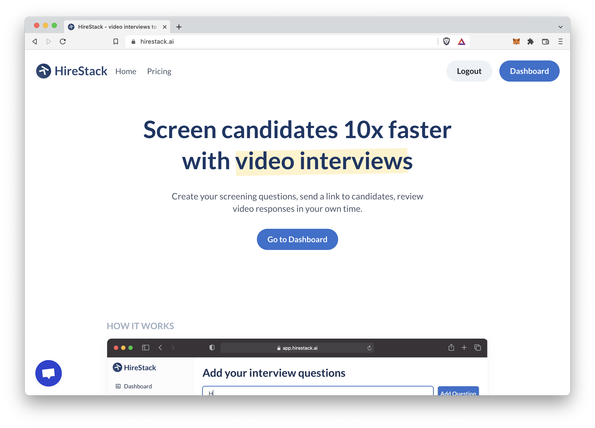

## Plan

#### Problem

Hiring is a major problem for a lot of companies. There are two key challenges:

 1. High supply roles - there are a lot of candidates applying for a given role, and it is difficult to differentiate them
 2. High demand roles - there are a very few candidates, and hiring these roles is critical to the business

These two problems require quite different solutions, so initially, we plan to solve for the first problem (high supply roles). Once we've solved that, we will look to move towards solving problems around the recruitment of high demand roles.

We choose high supply roles as an entrypoint as the solution is more simple and clear.

#### User

All companies, but particularly remote teams. Our focus initially will be on companies that hire at scale for high supply jobs. These are the types of people that benefit most for 

It's unlikely that early stage start ups would be a good fit for our initial product (high supply roles), as every employee at the early phase is absolutely critical. 

As always though, we will continue to speak to customers, and initially cast a wider net on our potential user base to avoid making costly incorrect assumptions.

#### Benefits video interviews

 * Saves time interviewing candidates

 * Reduces bias

 * Allows for more people in the company to be part of the process

 * Better collaberation and reviewing of feedback

#### Key to success

  * Building SEO (lots of people are already searching for video interviews)
  * Making the onboarding process incredibly simple

#### Marketing (after PH launch)

  * SEO

  * Engineering as marketing (more on this to follow)

#### Pricing / Revenue

Pricing will be mostly derived from our competitors in the field, as we know more this will no doubt be improved.

 * Free - one job, 10 interviews per month
 * Paid - starting at ~$30 a month

#### Competition

* VideoAsk - a more generic tool for video interviews, but it can be used for this use case

* SparkHire - a more traditional company in this space

* myInterview - a very basic product offering the bare bones service

